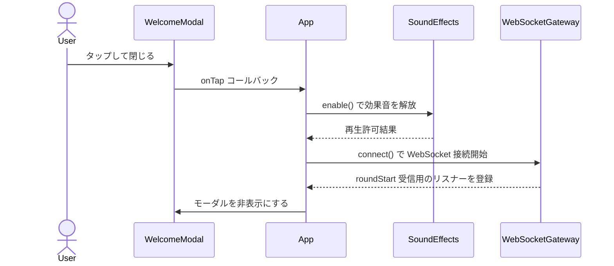
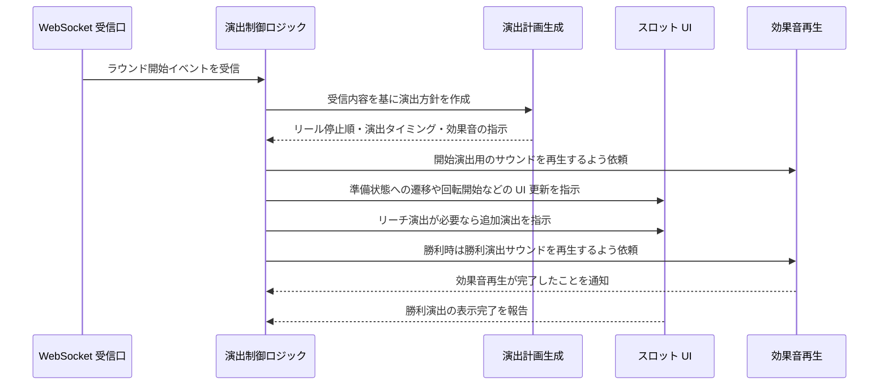

# Pachinko Member Frontend

このプロジェクトは、会員向けのスロット（ルーレット）演出を提供する React + TypeScript + Vite 製のフロントエンドです。WebSocket 経由でゲーム開始イベントを受け取り、指定した演出設定に従ってスロットを回転させます。

## プロジェクト構成

レイヤードアーキテクチャを採用し、主要な責務を以下のように分離しています。

| レイヤー | 役割 | 主な配置場所 |
| --- | --- | --- |
| **domain** | ルーレットの回転時間やシンボル定義、乱数生成など、ビジネスロジックの中心となる純粋なモデルを保持します。 | `src/domain/*` |
| **usecases** | ドメインを利用してアプリの振る舞いを調整するユースケース。ラウンド演出の計画やシンボルのプリロードなど、アプリの「やること」をまとめます。 | `src/usecases/*` |
| **infrastructure** | WebSocket ゲートウェイやオーディオ再生など、外部環境とのやり取りを担うアダプター層です。 | `src/infrastructure/*` |
| **presentation** | React コンポーネントや UI 用フックをまとめたプレゼンテーション層。ユーザーとのインタラクションと画面表示を担当します。 | `src/presentation/*` |

エントリーポイントとなる `src/main.tsx` からプレゼンテーション層を呼び出し、必要に応じて他レイヤーの機能を依存注入します。

## セットアップ

```bash
npm install
npm run dev
```

`.env` に `VITE_WEBSOCKET_URL` を設定すると、既定 URL の代わりにそのエンドポイントへ接続します。

## 実行時シーケンス

### ① Welcome モーダルダイアログを閉じた後の処理



### ② WebSocket を受信してスロットが回る処理


